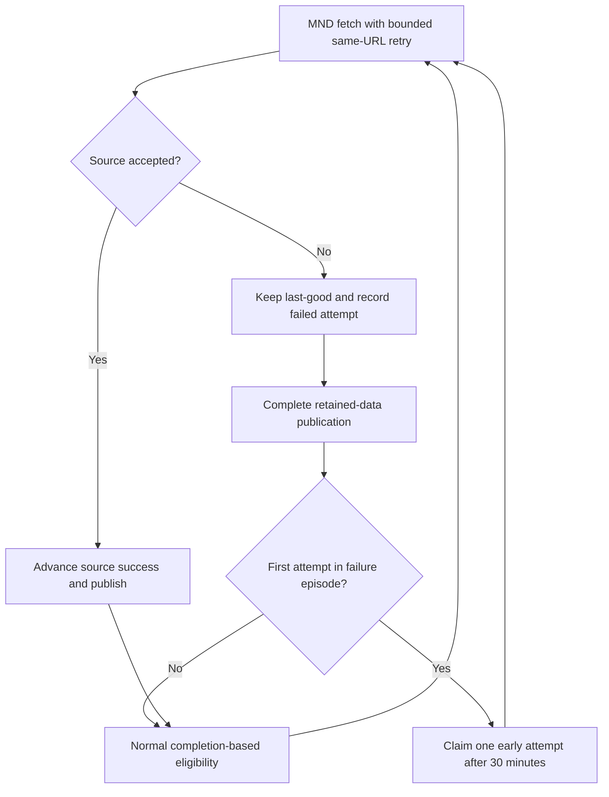

# MND Bounded Recovery - Plan

## Goal Capsule

Recover transient Taiwan MND failures without increasing per-run request or time limits, changing health deadlines, or discarding usable records.
Deliver one reviewed PR against current `main`.
Execution is sequential with one branch owner; this plan does not authorize production seeder calls, Redis writes, deployment, merge, or auto-merge.
Stop implementation when the two failure mechanisms have regression proof, required checks pass, and the ready PR records the separate production acceptance gate.

---

## Product Contract

### Summary and problem frame

The adapter retries missing publication metadata but not transient timeouts.
A failed refresh can still publish retained data and advance the completion clock, delaying another source attempt for 144 minutes.
Five observed natural attempts after the latest health deployment included two metadata failures, two successes, and a timeout failure.
Temporary recovery does not establish that recurrence is fixed.

At 06:20:41 UTC on September 6, the source recorded 10 requests, `TIMEOUT`, and `OUTBOUND_BUDGET_EXHAUSTED`.
Its last success remained 03:55:42 UTC, while the aggregate publication completed at 06:23:12 UTC.
Budget exhaustion alone is not a hard source error; the timeout makes this attempt fail.
The failing URL and network stage are not known.

### Requirements

**Transport recovery**

- R1. Retry a transient MND timeout once on the same list or detail URL when existing time and request budgets permit.
- R2. A detail request gets at most two total attempts, including mixed timeout and metadata failures; preserve the original error if a retry cannot fit.
- R3. Preserve the 20-detail-attempt cap, 11-list-attempt cap, 200-second outbound budget, per-request timeout, correction reservations, and publication cleanup headroom.

**Scheduled recovery and truthful health**

- R4. Permit one early natural recovery attempt 30 minutes after the first failed source attempt in an established failure episode, instead of waiting for normal completion-based admission.
- R5. Further failures in that episode use normal admission; changing the error code or crashing before source metadata publication must not renew the early-retry allowance.
- R6. Recovery scheduling must not modify publication time, source success time, retained data, failure identity, or the existing pending deadline.
- R7. Successful sources and bundle members that do not opt in retain their current scheduling behavior.

### Scope boundaries

No wider health grace, new source, proxy fallback, global cadence change, daily freshness relaxation, generic retry framework, or additional persistent retry key.
Do not suppress required-page errors or turn partial retained publication into source success.
The early attempt can increase total requests during an incident; cap it at one extra run per failure episode rather than allowing a permanent faster schedule.
Historical archive repair, other health warnings, and broad observability work are outside this PR.

---

## Planning Contract

### Key technical decisions

- KTD1. Extend the adapter's existing bounded retry loop. One layer owns attempts, and every retry consumes the same counters and monotonic time budget as a first request.
- KTD2. Use existing source-attempt metadata for early admission. The bundle section opts in with its source metadata key and a fixed 30-minute recovery delay. The runner reads a separate recovery due time rather than altering its publication timestamp.
- KTD3. Require consistent first-failure evidence before early admission. A positive prior success, retained records, degraded source state, first failure equal to latest attempt, and a completed publication at or after that attempt establish the eligible episode. Missing or contradictory recovery evidence does not invent an early allowance. Missing completion retains the existing due behavior.
- KTD4. Source chronology prevents renewal after a completed second attempt, including a changed error. Before an early child starts, atomically claim its existing completion marker with `sourceRetryClaimedFor`. Compare the exact old marker and preserve its timestamp and TTL. A failed or lost claim does not start the early child. Reserve the claim timeout in bundle admission.
- KTD5. The claim is necessary because a child can crash before it updates source metadata. Chronology alone would then allow repeated five-minute runs. A later completed publication replaces the marker normally, while the source chronology continues to block second-failure allowances. A genuine later source success permits a new episode. No new Redis key or source-health write is needed.

### High-level technical design

The scheduler allowance is eligibility, not a guarantee that Railway starts at that exact minute.
The five-minute cron, bundle runtime admission, and existing source lock still apply.
Upstream timeouts can persist after this repair; source errors must remain visible when both attempts fail.

### Sources and preserved constraints

- `scripts/cross-strait-activity/adapters.mjs`, especially budget checks, candidate scheduling, and required versus optional errors.
- `scripts/seed-cross-strait-activity.mjs`, especially `sourceAttemptMeta`, `writeSourceHealth`, and final publication completion.
- `scripts/_bundle-runner.mjs`, especially `readSectionFreshness` and the 80-percent interval gate.
- PRs [#7698](https://github.com/koala73/worldmonitor/pull/7698), [#7734](https://github.com/koala73/worldmonitor/pull/7734), and [#7753](https://github.com/koala73/worldmonitor/pull/7753) establish the earlier parser retry, optional-correction, and finite-pending boundaries.
- `docs/solutions/integration-issues/vendor-sdk-hidden-retries-nested-retry-ladder.md` explains why nested retry layers must not multiply requests.

No external library or provider choice is needed. Existing code and observed failure records determine the repair.

---

## Implementation Units

### U1. Retry transient MND timeouts within current caps

**Goal:** Satisfy R1-R3 without weakening source acceptance.
**Dependencies:** None.
**Files:** `scripts/cross-strait-activity/adapters.mjs`; `tests/cross-strait-activity.test.mts`.
**Approach:** Extend the existing detail retry condition and preserve its first failure when time expires. Add bounded list timeout recovery with real attempt counting. Retain non-retryable response and parser validation.
**Patterns to follow:** Existing missing-publication retry, monotonic budget checks, and optional correction tests.
**Execution note:** Start with failing timeout-then-success cases against the real adapter using controlled fetch responses and a deterministic clock.
**Test scenarios:** List and detail timeout then success; both attempts time out; timeout then malformed metadata and the reverse cannot get a third attempt; retry denied by elapsed time keeps the original hard error; retries consume request caps; correction first attempts retain their reservation; unsafe URLs and non-transient failures are not retried; last-good and success clocks survive persistent errors.
**Verification:** The new cases fail before the change and pass after it; all existing adapter regressions pass.

### U2. Admit one early source recovery attempt

**Goal:** Satisfy R4-R7 across source metadata, publication, and the real bundle gate.
**Dependencies:** U1.
**Files:** `scripts/_bundle-runner.mjs`; `scripts/seed-bundle-derived-signals.mjs`; `tests/bundle-runner.test.mjs`; `tests/cross-strait-activity-shipping.test.mts`; `docs/health-endpoints.mdx`; `docker/redis-rest-proxy.mjs`; `tests/redis-rest-proxy-command-parity.test.mjs`.
**Approach:** Add opt-in source recovery to the existing freshness gate. Keep publication freshness and retry eligibility separate. Claim an early attempt on the existing completion marker before starting the child. Register only Cross-Strait and document the bounded allowance.
**Patterns to follow:** Source-attempt metadata validation and duplicate/out-of-order protections; existing bundle freshness fixtures and publication-hook tests.
**Execution note:** First prove that a failed source plus a successful retained publication currently delays admission beyond 30 minutes. Exercise the actual source-health writer and reader chain with in-memory Redis transport, not copied scheduling logic.
**Test scenarios:** Before and at the 30-minute boundary; healthy normal cadence; first failure; duplicate metadata write; second same-cause failure; changed-cause second failure; recovery followed by a new episode; missing or malformed source metadata; missing completion; future or contradictory clocks; unchanged non-opt-in members; retained data and fixed pending deadline survive the early attempt. Execute the actual claim Lua in the existing test VM. Verify duplicate claims, changed or missing markers, preserved TTL, failed claims, and a child exit without source metadata publication.
**Verification:** Producer-to-admission tests and bundle regressions pass. Only the opt-in completion marker gets a claim field; no success-clock rewrite occurs. The self-hosted proxy must accept the exact producer claim script while rejecting modified and arbitrary Lua. Its isolated Docker build needs a pinned copy, verified through the actual command gate.

---

## Verification Contract

- Run the focused adapter, Cross-Strait shipping, bundle-runner, bundle budget admission, and bundle completion attestation tests.
- Run affected health classification and finite-pending tests, browser and API typechecks, import-boundary checks, and `git diff --check`.
- Verify derived-signals deployment watch paths already include every changed runtime file; change the service manifest only if that check identifies a real omission.
- Run the repository pre-push gate and review the exact PR head. Keep CI, approval, merge, deployment, and production acceptance distinct.
- After an authorized merge and natural deployment, observe the first failure and next source attempt. Confirm one early attempt near 30-35 minutes, no renewed allowance after a second failure, unchanged request caps, and true success timestamp advancement on recovery. A source failure during this window remains an incident, even when retained data keeps the dashboard usable.

## Definition of Done

U1 and U2 have observed failing-before and passing-after proof, relevant existing checks pass, and code review leaves no blocking defect.
The PR contains only the focused repair, regression tests, this plan, and necessary health documentation.
Abandoned alternatives and temporary instrumentation are absent from the diff.
The PR is ready for review, with CI results and unverified natural production acceptance stated explicitly.
No production mutation or merge is part of completion.
